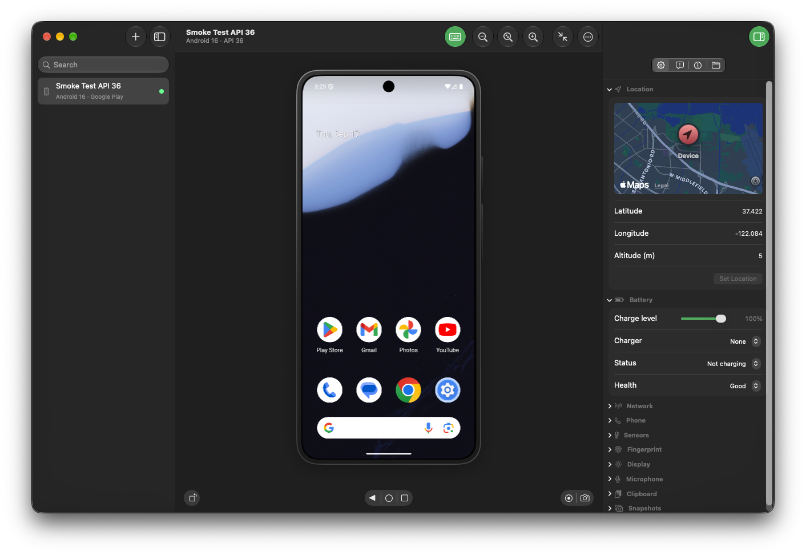
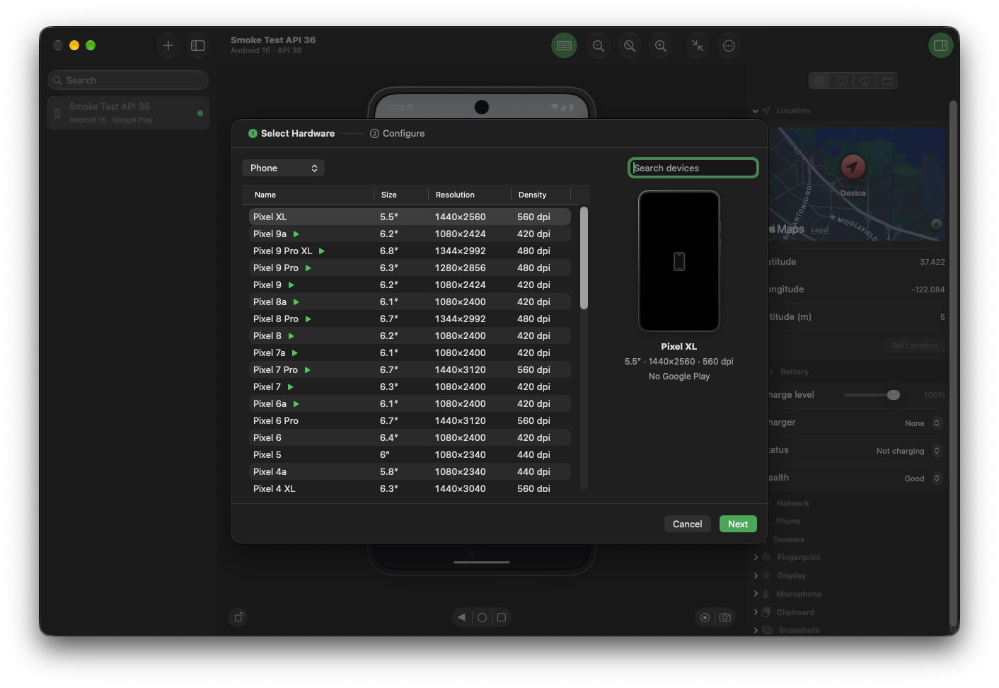
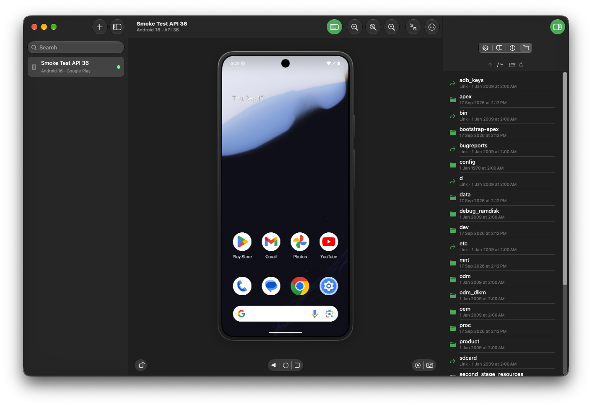
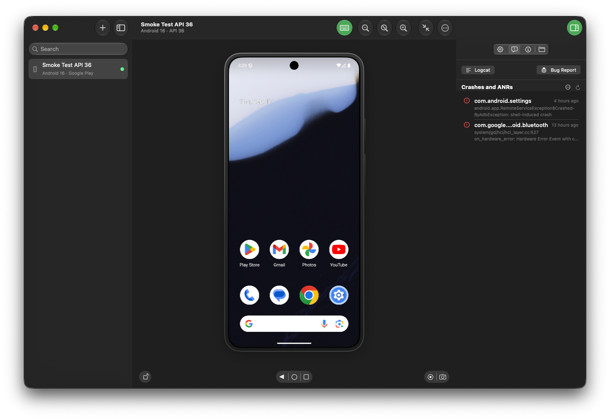
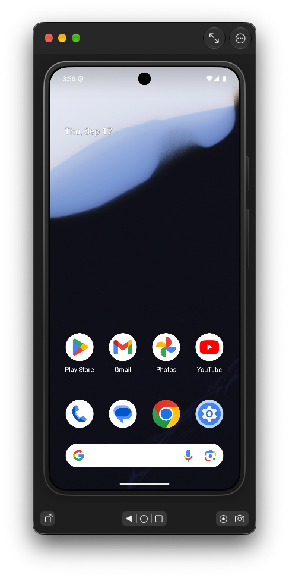

# Android Device Hub

A native macOS app for creating and running Android emulators, without Android Studio or Java.
Its design is inspired by Apple's Device Hub in macOS 27.

> [!WARNING]
> **This is a beta.** I built it for my own use and I'm sharing it as is. Many features are missing,
> you should expect bugs, and I can't promise support or a schedule for fixes.
> Physical devices aren't supported yet.



## Features

- **Emulators without Android Studio:** the app finds your Android SDK folder or creates one, and downloads
  the emulator, platform tools and system images itself.
- **Create emulators:** choose from phone, tablet, foldable, desktop, TV, Wear OS and automotive hardware profiles,
  then pick a system image.
- **Emulator in the window:** the screen is drawn inside the app, with zoom, rotation, keyboard input,
  and Back, Home and Recents buttons.
- **Compact window:** a small window with just the device and its controls.
- **Screenshots and screen recordings** straight from the window.
- **Simulated hardware:** location, battery, network, phone calls and SMS, sensors, fold posture,
  fingerprint, display, microphone and clipboard.
- **Snapshots:** save and restore an emulator's state.
- **Device info and apps:** hardware and software details. Install APKs, and uninstall, force-stop or
  clear data for any app. Manage users and work profiles.
- **Files:** browse the device, drag files in to upload them, and download, rename or delete them.
- **Crashes and logs:** crash and ANR reports, a live filterable Logcat window, and bug reports.
- **Manage devices:** duplicate, wipe, cold-boot or delete an emulator.

<p>
  
  
</p>
<p>
  
  
</p>

## Install

Requires **macOS 26 or later**. Only tested on Apple silicon.

1. Download the latest `Android-Device-Hub-<version>.zip` from
   [Releases](https://github.com/najm101/AndroidDeviceHub/releases).
2. Unzip it and drag **Android Device Hub** into your **Applications** folder.
3. Open it. On first launch, it walks you through setting up the Android SDK.

Every change on `main` is built, signed, notarized and published as a new pre-release automatically.

## Build from source

You need Xcode 26 or later and [Homebrew](https://brew.sh).

```bash
Scripts/bootstrap.sh     # installs the tools in the Brewfile and generates the Xcode project
Scripts/run-debug.sh     # builds and launches the Debug app
```

See [CONTRIBUTING.md](CONTRIBUTING.md) for the project layout, tests and scripts.

## License

[Mozilla Public License 2.0](LICENSE). Third-party licenses are listed in
[ThirdPartyNotices.md](App/Resources/ThirdPartyNotices.md).

Android is a trademark of Google LLC. Apple and macOS are trademarks of Apple Inc.
This project isn't affiliated with or endorsed by Google or Apple.
